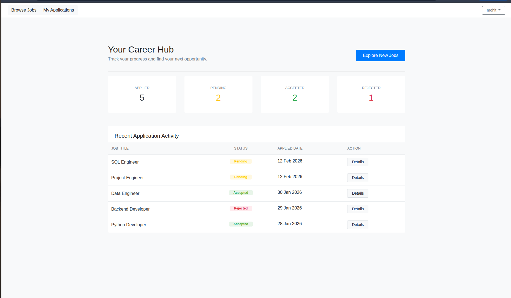
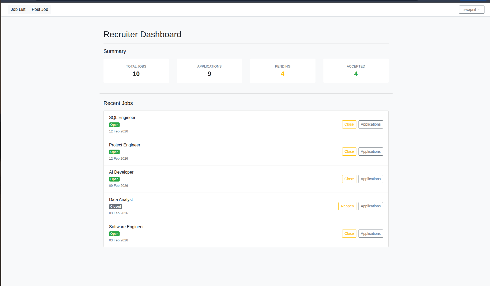
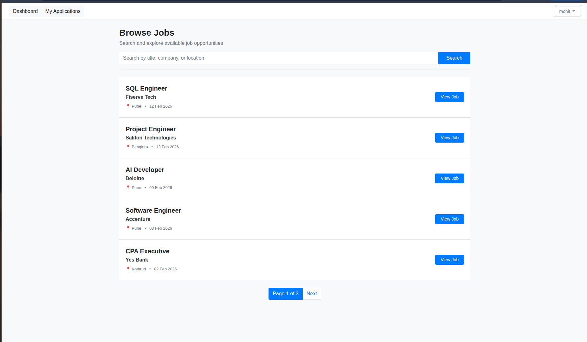
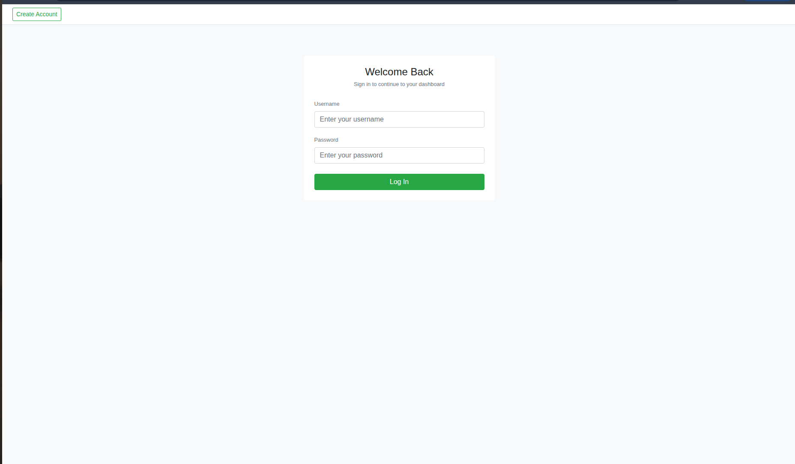

# Job Portal – Django

A role-based **Job Portal web application** built using **Django**, where **Recruiters** can post and manage jobs, and *
*Jobseekers** can apply for jobs and track their application status.

This project demonstrates **role-based authentication**, **state-driven workflows**, **search & pagination**, and *
*clean dashboard-driven UI**, following real-world backend patterns.

---

## 🚀 Features

### 👤 Authentication & Authorization

- Custom User model with role-based access (`jobseeker`, `recruiter`)
- Signup, Login, Logout
- Role-based dashboard redirection
- Route protection using `login_required`
- Secure access control for actions and views

---

### 🧑‍💼 Recruiter Features

- Recruiter dashboard with job and application metrics
- Post new jobs
- Edit and manage posted jobs
- Open / Close job postings
- View list of recruiter-owned jobs
- Search and paginate recruiter job list
- View applications per job
- Accept / Reject job applications
- Withdrawn applications hidden from recruiter view
- Download applicant resumes
- Access restricted strictly to recruiter-owned jobs

---

### 🧑‍🎓 Jobseeker Features

- Jobseeker dashboard with application summary
- View all open jobs
- Search and paginate job listings
- View job details
- Apply for jobs with resume upload
- Prevent duplicate job applications
- Withdraw application while status is `pending`
- View “My Applications” with real-time status tracking
- Clear visual status indicators (Pending / Accepted / Rejected / Withdrawn)

---

### 📂 Application Management

- Separate `applications` app
- Application state management:
    - Pending
    - Accepted
    - Rejected
    - Withdrawn
- Resume upload with file type validation (PDF / DOC / DOCX)
- Secure file handling using `MEDIA_ROOT` and `MEDIA_URL`

---

### 🔍 Search & Pagination

- Job search using `icontains`
- Search by job title, company, and location
- Pagination for:
    - Job listings
    - Recruiter job list
- Search query preserved across pages

---

### 🎨 UI & UX Enhancements

- Consistent intermediate-level UI using Bootstrap
- Dashboard-style layouts
- Status badges with color coding
- Role-aware navigation bar
- User-friendly alerts and messages
- Clean spacing and layout consistency

---

### 🛠 Admin Panel Enhancements

- Search and filter jobs in Django Admin
- Filter applications by status
- Improved list displays for faster admin operations

---

## 🏗 Project Structure

jobportal/
├── accounts/ # Authentication & user roles
├── jobs/ # Job management
├── applications/ # Job applications
├── templates/ # HTML templates (base + app templates)
├── static/ # Static files
├── media/ # Uploaded resumes
├── manage.py
└── README.md

---

## ⚙️ Local Development Setup

### Prerequisites

- Python 3.10+
- pip
- Virtualenv (recommended)

---

### Installation Steps

```bash
git clone https://github.com/<your-username>/jobportal.git
cd jobportal

python -m venv venv
source venv/bin/activate  # Linux / Mac
venv\Scripts\activate     # Windows

pip install -r requirements.txt

python manage.py migrate
python manage.py runserver

#Media Configuration(for resume upload)
MEDIA_URL = "/media/"
MEDIA_ROOT = BASE_DIR / "media"
```

### 👥 User Roles Overview

| Role      | Capabilities                                            |
|-----------|---------------------------------------------------------|
| Jobseeker | Browse jobs, apply, withdraw applications, track status |
| Recruiter | Post jobs, manage jobs, review and process applications |
| Admin     | Manage users, jobs, and applications via Django Admin   |

### 📌 Key Learning Outcomes

- Custom user model with roles
- Role-based access control
- State-driven workflows
- Search and pagination
- Secure file uploads
- Clean dashboard-driven UI
- Django Admin customization

### 📌 Key Learning Outcomes

- Custom user model with roles
- Role-based access control
- State-driven workflows
- Search and pagination
- Secure file uploads
- Clean dashboard-driven UI
- Django Admin customization

### 📸 Screenshots

### Jobseeker Dashboard



### Recruiter Dashboard



### Job Listings with Search & Pagination


### Browse Jobs with Search & Pagination



### Login



### SignUp


### License

This Project is for Learning and Portfolio Purpose